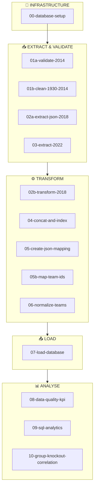
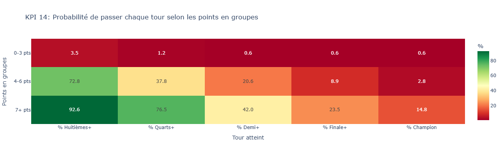
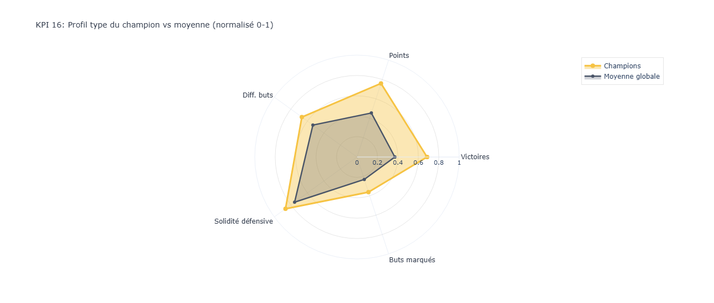

# Projet ETL - Consolidation des Données Coupe du Monde FIFA 1930-2022

---

**Équipe Short Kings**
Formation Simplon Data Engineering
Décembre 2025

---

| Métrique | Valeur |
|----------|--------|
| Matchs consolidés | 7 427 |
| Équipes normalisées | 226 |
| Éditions couvertes | 22 (1930-2022) |
| Sources harmonisées | 4 |
| Durée du sprint | 4 jours |
| Contributeurs | 4 |

---

## Table des Matières

1. [Résumé Exécutif](#1-résumé-exécutif)
2. [Introduction et Contexte](#2-introduction-et-contexte)
3. [Sources de Données](#3-sources-de-données)
4. [Architecture du Pipeline ETL](#4-architecture-du-pipeline-etl)
5. [Qualité des Données et KPIs](#5-qualité-des-données-et-kpis)
6. [Difficultés Rencontrées et Solutions](#6-difficultés-rencontrées-et-solutions)
7. [Stack Technique et Compétences](#7-stack-technique-et-compétences)
8. [Conclusion et Perspectives](#8-conclusion-et-perspectives)
9. [Annexes](#9-annexes)

---

## 1. Résumé Exécutif

### Contexte

Dans le cadre de la formation Simplon Data Engineering, l'équipe **Short Kings** a réalisé un projet ETL complet visant à consolider **92 ans d'histoire** de la Coupe du Monde FIFA (1930-2022) en une base de données unique et exploitable.

### Objectif

Construire un pipeline ETL robuste permettant de :
- **Extraire** des données de 4 sources hétérogènes (CSV, JSON, API)
- **Transformer** et normaliser les données (notamment les 350+ variantes de noms d'équipes)
- **Charger** dans une base PostgreSQL partitionnée et optimisée

### Résultats Clés

| Livrable | Détail |
|----------|--------|
| Dataset consolidé | 7 427 matchs uniques avec IDs standardisés |
| Référentiel équipes | 226 équipes normalisées (incluant équipes historiques) |
| Base de données | PostgreSQL partitionnée par édition (22 partitions) |
| Vues analytiques | 3 vues pré-calculées (stats globales, par édition, confrontations) |
| Documentation | Pipeline reproductible avec 14 notebooks documentés |

### Valeur Ajoutée

- **Unicité** : Premier dataset consolidant l'intégralité des 22 éditions
- **Qualité** : Normalisation rigoureuse des noms d'équipes selon la FIFA sur 92 ans
- **Scalabilité** : Architecture extensible pour les futures éditions (2026, 2030)
- **Analyses** : Corrélation statistique phase de groupes → parcours final (r=0.755, p<0.001)

---

## 2. Introduction et Contexte

### 2.1 Présentation du Brief

Le brief Simplon demandait de créer une **pipeline ETL complète** pour les données de la Coupe du Monde FIFA, depuis l'extraction de données brutes jusqu'à leur exploitation analytique. Les contraintes principales étaient :

- Données provenant de sources multiples et hétérogènes
- Incohérences historiques (noms d'équipes, formats de dates)
- Nécessité d'une base de données relationnelle optimisée

### 2.2 Équipe et Répartition des Rôles

| Membre | Responsabilités principales |
|--------|----------------------------|
| **Zoubir** | Coordination Git, extraction et transformation WC 2022, gestion des APIs, documentation |
| **Romain** | Setup PostgreSQL partitionné, normalisation équipes (~170 aliases), requêtes SQL analytiques |
| **JS** | Extraction données historiques 1930-2010, nettoyage CSV, parsing dates |
| **Sabine** | Extraction JSON WC 2018, transformation et mapping rounds, documentation, préparation de la présentation |

### 2.3 Contraintes et Enjeux

| Contrainte | Impact | Solution |
|------------|--------|----------|
| **Temporelle** | 4 jours | Parallélisation des tâches, répartition par édition |
| **Hétérogénéité sources** | Formats CSV/JSON différents | Notebooks dédiés par source |
| **Données historiques** | Noms d'équipes incohérents, dates manquantes | Module de normalisation centralisé |
| **Scalabilité** | Futures éditions à intégrer | Partitionnement PostgreSQL |

Le projet reposait sur la validation collective du fichier `matches.csv` consolidé avant tout chargement en base, et donc en amont sur la cohérence des 3 CSV sources avec les tables de la base de données.

---

## 3. Sources de Données

### 3.1 Inventaire des Sources

| Source | Format | Période | Volume | Problèmes identifiés |
|--------|--------|---------|--------|---------------------|
| `matches_19302010.csv` | CSV | 1930-2010 | 7 299 lignes | Dates manquantes, noms avec caractères locaux |
| `WorldCupMatches2014.csv` | CSV | 2014 | 64 matchs | 16 MatchIDs dupliqués, encodage Côte d'Ivoire |
| `data_2018.json` | JSON | 2018 | 64 matchs | Structure imbriquée (groupes/éliminatoires) |
| Kaggle 2022 | API/CSV | 2022 | 64 matchs | Tirs au but non normalisés |

### 3.2 Analyse Exploratoire des Données

#### Problèmes identifiés par source

**Source 1930-2010 :**
- 6 480 dates manquantes (87% du dataset)
- ~262 variantes de noms d'équipes (ex: "Germany (Deutschland)", "FRG", "West Germany")
- Scores au format complexe : "4-1 (3-0)" avec indicateurs AET/replay/penalties
- Équipes historiques dissoutes (URSS, Yougoslavie, Tchécoslovaquie)

**Source 2014 :**
- 16 MatchIDs dupliqués à dédupliquer
- Caractères spéciaux corrompus (Côte d'Ivoire → "C�te d'Ivoire")

**Source 2018 :**
- JSON hiérarchique : `teams → groups → matches → knockouts`
- Nécessité de parsing récursif

**Source 2022 :**
- Distinction score affiché vs vainqueur final (tirs au but)
- Colonnes de possession en pourcentages

### 3.3 Schéma de Données Cible

```
┌─────────────────────────────────────────────────────────────┐
│                         SCHÉMA BDD                          │
└─────────────────────────────────────────────────────────────┘

┌──────────────────────┐         ┌──────────────────────────────┐
│       TEAMS          │         │          MATCHES             │
├──────────────────────┤         ├──────────────────────────────┤
│ id_team (PK)         │◄───────┐│ id_match (PK)                │
│ nom_standard         │        ││ home_team_id (FK) ──────────►│
│ confederation        │        ││ away_team_id (FK) ──────────►│
│ aliases (JSONB)      │        │└──────────────────────────────┤
└──────────────────────┘        │ home_result                   │
                                │ away_result                   │
                                │ result                        │
                                │ extra_time                    │
                                │ penalties                     │
                                │ replay                        │
                                │ date                          │
                                │ round                         │
                                │ city                          │
                                │ edition (partition key)       │
                                └──────────────────────────────┘
                                          │
                                          ▼
                                ┌──────────────────────┐
                                │    PARTITIONS        │
                                ├──────────────────────┤
                                │ matches_1930         │
                                │ matches_1934         │
                                │ ...                  │
                                │ matches_2022         │
                                └──────────────────────┘
```

### 3.4 Périmètre des Données

| Catégorie | Couverture | Note |
|-----------|------------|------|
| Phases finales | 22 éditions (1930-2022) | 100% couverture |
| Qualifications | Partielles (pré-1998) | Selon disponibilité des sources |
| KPIs analytiques | Phases finales uniquement | Excluent les matchs de qualification |

> **Note** : Les analyses statistiques (corrélations, KPIs) portent exclusivement sur les phases finales pour garantir la cohérence historique. Les matchs de qualification, présents partiellement dans les données 1930-2010, sont exclus des calculs de performance.

---

## 4. Architecture du Pipeline ETL

### 4.1 Vue d'Ensemble

Le pipeline se compose de **14 notebooks** organisés en 4 phases :



<details>
<summary>Version ASCII (compatibilité)</summary>

```
┌─────────────────────────────────────────────────────────────┐
│                    PIPELINE ETL - 14 NOTEBOOKS              │
└─────────────────────────────────────────────────────────────┘

🔧 INFRASTRUCTURE
└── 00-database-setup.ipynb
    └─→ Schéma PostgreSQL partitionné (teams, matches, 3 vues)

📥 EXTRACT & VALIDATE
├── 01a-validate-2014.ipynb (rapport qualité)
├── 01b-clean-1930-2014.ipynb (7 299 matchs)
├── 02a-extract-json-2018.ipynb (64 matchs)
└── 03-extract-2022.ipynb (64 matchs)

⚙️ TRANSFORM
├── 02b-transform-2018.ipynb
├── 04-concat-and-index.ipynb
├── 05-create-json-mapping.ipynb
├── 05b-map-team-ids.ipynb
└── 06-normalize-teams.ipynb (226 équipes)

📤 LOAD
└── 07-load-database.ipynb
    └─→ PostgreSQL (7 427 matchs, 226 équipes)

📊 ANALYSE
├── 08-data-quality-kpi.ipynb
├── 09-sql-analytics.ipynb
└── 10-group-knockout-correlation.ipynb
```

</details>

### 4.2 Phase Extract

#### Notebook `02a-extract-json-2018.ipynb`

| Élément | Détail |
|---------|--------|
| **Input** | `data/raw/data_2018.json` |
| **Process** | Parsing JSON FIFA API, séparation groupes/éliminatoires |
| **Output** | `data/staging/matches_2018_raw.csv` (64 matchs) |
| **Défi** | Structure imbriquée sur 4 niveaux |

#### Notebook `01b-clean-1930-2014.ipynb`

| Élément | Détail |
|---------|--------|
| **Input** | `data/raw/matches_19302010.csv` |
| **Process** | Extraction édition, parsing scores complexes ("4-1 (3-0)") |
| **Output** | 7 299 matchs nettoyés |
| **Défi** | Gestion AET/replay/penalties dans les scores |

#### Notebook `03-extract-2022.ipynb`

| Élément | Détail |
|---------|--------|
| **Input** | Dataset Kaggle via `kagglehub` |
| **Process** | Nettoyage possession, gestion tirs au but |
| **Output** | `data/processed/df_matches_final.csv` (64 matchs) |
| **Défi** | Distinction score affiché vs vainqueur final |

### 4.3 Phase Transform

#### Normalisation des Équipes (`06-normalize-teams.ipynb`)

C'est le **cœur technique** du projet. Problématique : ~262 variantes de noms pour 226 équipes.

**Exemples de normalisation :**

| Alias original | Nom FIFA standard |
|----------------|-------------------|
| FRG (BRD / Westdeutschland) | Germany |
| Belgium (België) | Belgium |
| Ivory Coast (Côte d'Ivoire) | Côte d'Ivoire |
| South Korea (한국) | Korea Republic |
| C�te d'Ivoire | Côte d'Ivoire |
| Soviet Union (СССР) | Soviet Union |

**Gestion des équipes historiques :**

| Équipe dissoute | Année | Successeur FIFA | Confédération |
|-----------------|-------|-----------------|---------------|
| Soviet Union | 1991 | Russia | UEFA |
| Yugoslavia | 2003 | Serbia | UEFA |
| Czechoslovakia | 1993 | Czech Republic | UEFA |
| GDR | 1990 | Germany | UEFA |
| Zaire | 1997 | Congo DR | CAF |

**Règle spéciale Allemagne :**
> La RFA (FRG) est la continuité juridique de l'Allemagne actuelle selon les règles FIFA/UEFA. Tous les matchs de la RFA sont attribués à "Germany". Seule la RDA (GDR) reste une entité historique distincte.

#### Concaténation (`04-concat-and-index.ipynb`)

| Élément | Détail |
|---------|--------|
| **Inputs** | 3 datasets (2022: 64, 2018: 64, 1930-2014: 7 299) |
| **Process** | Fusion, tri chronologique, mapping équipes → IDs |
| **Output** | Dataset unifié avec `id_match` séquentiel |
| **Validation** | Vérification doublons, cohérence scores |

#### Création du Référentiel Équipes (`05-create-json-mapping.ipynb`)

| Élément | Détail |
|---------|--------|
| **Inputs** | Noms d'équipes extraits des 3 datasets sources |
| **Process** | Extraction des équipes uniques, ajout confédérations et aliases |
| **Output** | `data/reference/teams_mapping.json` (231 équipes) |
| **Défi** | Collecte et structuration des métadonnées FIFA |

**Processus détaillé :**
1. Extraction des équipes uniques depuis `matches_19302010.csv` (186 équipes)
2. Ajout des équipes de 2014 et 2018 (32 équipes chacun)
3. Chargement des confédérations depuis le ranking FIFA
4. Construction du dictionnaire d'aliases via `teams_constants.py`
5. Génération du JSON de référence avec structure :
```json
{
  "France": {
    "confederation": "UEFA",
    "aliases": ["France"],
    "is_historical": false
  },
  "Soviet Union": {
    "confederation": "UEFA",
    "aliases": ["USSR", "URSS", "Soviet Union"],
    "is_historical": true,
    "fifa_successor": "Russia",
    "dissolved_year": 1991
  }
}
```

#### Mapping des IDs Équipes (`05b-map-team-ids.ipynb`)

| Élément | Détail |
|---------|--------|
| **Inputs** | `matches.csv` + `teams_mapping.json` |
| **Process** | Remplacement des noms d'équipes par leurs IDs numériques |
| **Output** | `matches.csv` mis à jour avec `home_team_id` et `away_team_id` numériques |
| **Défi** | Gestion des variations de casse et caractères spéciaux |

**Fonction principale :**
```python
def map_name_to_id(name: str) -> int | None:
    """Recherche l'ID numérique d'une équipe par son nom.

    Essaie plusieurs variantes de casse :
    1. Correspondance exacte
    2. Minuscules
    3. Title Case
    4. Majuscules
    """
```

#### Normalisation et Déduplication (`06-normalize-teams.ipynb`)

| Élément | Détail |
|---------|--------|
| **Input** | `teams_mapping.json` (231 équipes) |
| **Process** | Normalisation des noms, détection/fusion des doublons |
| **Output** | `teams_traitees.csv` (226 équipes dédupliquées) |
| **Défi** | Gestion des IDs dupliqués (ex: Antigua and Barbuda ID 8 et 9) |

**Processus de déduplication :**
1. Application de `normalize_team_name()` sur toutes les équipes
2. Détection des doublons par `nom_standard` identique
3. Création du mapping `{ancien_id: nouvel_id}` (conservation du plus petit ID)
4. Mise à jour de `matches.csv` avec les IDs fusionnés
5. Export du référentiel final : 231 → 226 équipes

**Exemple de fusion :**
```
Avant : Antigua and Barbuda (ID 8), Antigua and Barbuda (ID 9)
Après : Antigua and Barbuda (ID 8) - ID 9 redirigé vers 8
```

---

### 4.4 Flux de Données Complet

Le diagramme suivant illustre le cheminement des fichiers à travers le pipeline :

```
┌─────────────────────────────────────────────────────────────────────────────┐
│                        FLUX DE DONNÉES ETL COMPLET                          │
└─────────────────────────────────────────────────────────────────────────────┘

DONNÉES BRUTES (data/raw/)
├── matches_19302010.csv ────────────┐
│   └── 7 299 matchs, 1930-2010      │
├── WorldCupMatches2014.csv ─────────┤
│   └── 80 lignes (64 + 16 doublons) │
├── data_2018.json ──────────────────┤
│   └── 64 matchs, structure FIFA    │
└── Kaggle WC 2022 ──────────────────┤
    └── 64 matchs via kagglehub      │
                                     │
                    ┌────────────────┘
                    ▼
┌─────────────────────────────────────────────────────────────────────────────┐
│ PHASE EXTRACT                                                               │
│                                                                             │
│ 01a-validate-2014    →  Rapport qualité (16 doublons détectés)              │
│ 01b-clean-1930-2014  →  data/processed/matches_1930_2014.csv (7 299)        │
│ 02a-extract-2018     →  data/staging/matches_2018_raw.csv (64)              │
│ 03-extract-2022      →  data/processed/df_matches_final.csv (64)            │
└─────────────────────────────────────────────────────────────────────────────┘
                    │
                    ▼
┌─────────────────────────────────────────────────────────────────────────────┐
│ PHASE TRANSFORM                                                             │
│                                                                             │
│ 02b-transform-2018                                                          │
│   └── data/staging/matches_2018_raw.csv                                     │
│       ↓                                                                     │
│       data/processed/matches_2018_clean.csv (64 matchs, 14 colonnes)        │
│                                                                             │
│ 04-concat-and-index                                                         │
│   └── matches_1930_2014.csv + matches_2018_clean.csv + df_matches_final.csv │
│       ↓                                                                     │
│       data/processed/matches.csv (7 427 matchs, id_match 1-7427)            │
│                                                                             │
│ 05-create-json-mapping                                                      │
│   └── Extraction équipes uniques des 3 datasets                             │
│       ↓                                                                     │
│       data/reference/teams_mapping.json (231 équipes)                       │
│                                                                             │
│ 05b-map-team-ids                                                            │
│   └── matches.csv + teams_mapping.json                                      │
│       ↓                                                                     │
│       data/processed/matches.csv (avec home_team_id/away_team_id numériques)│
│                                                                             │
│ 06-normalize-teams                                                          │
│   └── teams_mapping.json (231)                                              │
│       ↓                                                                     │
│       data/processed/teams_traitees.csv (226 équipes dédupliquées)          │
│       + Mise à jour matches.csv (IDs fusionnés)                             │
└─────────────────────────────────────────────────────────────────────────────┘
                    │
                    ▼
┌─────────────────────────────────────────────────────────────────────────────┐
│ PHASE LOAD                                                                  │
│                                                                             │
│ 07-load-database                                                            │
│   └── teams_traitees.csv (226) + matches.csv (7 427)                        │
│       ↓                                                                     │
│       PostgreSQL (Render.com)                                               │
│       ├── Table teams (226 lignes)                                          │
│       ├── Table matches (7 427 lignes, 22 partitions)                       │
│       └── Vues : v_team_stats, v_team_by_edition, v_head_to_head            │
└─────────────────────────────────────────────────────────────────────────────┘
```

---

### 4.5 Fonctions de Normalisation (Module `src/`)

Le module `src/` contient les fonctions centrales de normalisation utilisées par les notebooks 05, 05b et 06.

#### 4.5.1 `teams_reference.py` - Fonctions Principales

| Fonction | Signature | Description |
|----------|-----------|-------------|
| `normalize_team_name` | `(raw_name: str) → str \| None` | Convertit un nom brut en nom FIFA standard |
| `get_confederation` | `(team_name: str) → str \| None` | Retourne le code confédération (UEFA, CONMEBOL, etc.) |
| `get_aliases` | `(team_name: str) → list[str]` | Retourne la liste des noms alternatifs |
| `build_alias_to_fifa_mapping` | `() → dict` | Construit le dictionnaire alias → nom FIFA |
| `is_historical_team` | `(team_name: str) → bool` | Vérifie si l'équipe est dissoute |
| `get_successor` | `(team_name: str) → str \| None` | Retourne le successeur FIFA d'une équipe dissoute |

**Détail : `normalize_team_name(raw_name: str) → str | None`**

Cette fonction est le cœur du système de normalisation. Elle applique une logique en cascade :

```python
def normalize_team_name(raw_name: str) -> str | None:
    """
    Convertit un nom d'équipe brut vers le nom FIFA standard.

    Ordre de priorité :
    1. Vérification NaN/null → None
    2. Vérification placeholders (A1, WINNER, etc.) → None
    3. Recherche dans ALIASES_MAPPING_LOWER (insensible à la casse)
    4. Recherche exacte dans ALIASES_MAPPING
    5. Recherche dans CONFEDERATIONS_LOWER
    6. Cas spéciaux (Ethiopia, Ivory Coast, Armenia)
    7. Retour du nom original si aucune correspondance

    Exemples :
        "West Germany" → "Germany"
        "South Korea" → "Korea Republic"
        "C°te d'Ivoire" → "Côte d'Ivoire"  # Correction encodage
        "A1" → None  # Placeholder exclu
    """
```

#### 4.5.2 `teams_constants.py` - Données de Référence

Ce fichier contient les dictionnaires de mapping utilisés par les fonctions de normalisation :

**`ALIASES_MAPPING`** (290+ entrées)
```python
ALIASES_MAPPING = {
    # Allemagne et ses variantes
    "FRG": "Germany",
    "West Germany": "Germany",
    "FRG (BRD / Westdeutschland)": "Germany",
    "Allemagne de l'Ouest": "Germany",

    # Corée du Sud
    "South Korea": "Korea Republic",
    "Korea Republic": "Korea Republic",
    "한국": "Korea Republic",

    # Côte d'Ivoire et ses problèmes d'encodage
    "Ivory Coast": "Côte d'Ivoire",
    "C°te d'Ivoire": "Côte d'Ivoire",  # Encodage corrompu
    "Cote d'Ivoire": "Côte d'Ivoire",

    # ...
}
```

**`HISTORICAL_TEAMS`** (équipes dissoutes)
```python
HISTORICAL_TEAMS = {
    "Soviet Union": (1991, "Russia", "UEFA"),
    "Yugoslavia": (2003, "Serbia", "UEFA"),
    "Czechoslovakia": (1993, "Czech Republic", "UEFA"),
    "GDR": (1990, "Germany", "UEFA"),
    "Zaire": (1997, "Congo DR", "CAF"),
}
```

**`PLACEHOLDERS`** (entrées à exclure)
```python
PLACEHOLDERS = {"A1", "A2", "B1", "B2", "WINNER", "LOSER", "1A", "2B", ...}
```

#### 4.5.3 `normalize_teams.py` - Orchestration

Fonction principale du notebook 06 :

```python
def normalize_teams(update_matches: bool = True) -> Tuple[DataFrame, List]:
    """
    Orchestre la normalisation complète des équipes avec déduplication.

    Processus :
    1. Charge teams.csv
    2. Applique normalize_team_name() sur chaque équipe
    3. Ajoute les confédérations via get_confederation()
    4. Ajoute les aliases via get_aliases()
    5. Détecte les doublons (même nom_standard, IDs différents)
    6. Crée id_mapping {ancien_id: nouvel_id} (garde le plus petit)
    7. Met à jour matches.csv en remplaçant les IDs
    8. Exporte teams_traitees.csv

    Returns :
        (DataFrame normalisé, Liste des équipes non matchées)
    """
```

---

### 4.6 Fonctions de Détermination du Vainqueur

Ces fonctions résolvent le problème critique : déterminer le vainqueur d'un match nul en phase éliminatoire.

#### 4.6.1 `get_result(row, df_full) → str`

Fonction principale de détermination du résultat (notebooks 01b et 04) :

```python
def get_result(row, df_full) -> str:
    """
    Détermine le résultat d'un match : 'home_team', 'away_team' ou 'draw'.

    Paramètres :
        row : Ligne du match avec colonnes [score_team1, score_team2, round,
              edition_year, team1, team2, replay]
        df_full : Dataset complet pour contexte (recherche tour suivant)

    Logique (par ordre de priorité) :

    1. SCORES DIFFÉRENTS
       score1 > score2 → 'home_team'
       score1 < score2 → 'away_team'

    2. PHASE DE GROUPES (matchs nuls autorisés)
       round IN ['Preliminary', 'Group Stage', 'Second Group Stage']
       ET score1 == score2 → 'draw'

    3. MATCH REPLAY
       replay == True ET score1 == score2 → 'draw'

    4. FINALES AUX TIRS AU BUT (hardcodées)
       FINALS_PENALTY_WINNERS = {1994: 'Brazil', 2006: 'Italy'}

    5. DÉDUCTION VIA TOUR SUIVANT
       → Appel à find_winner_from_next_round()
    """
```

#### 4.6.2 `find_winner_from_next_round(row, df_full) → str | None`

Résout les matchs nuls en phase éliminatoire en vérifiant la progression :

```python
def find_winner_from_next_round(row, df_full) -> str | None:
    """
    Trouve le vainqueur d'un match éliminatoire en vérifiant
    quelle équipe apparaît au tour suivant.

    Mappings utilisés :

    WINNER_ROUND_MAP = {
        'Round of 16': 'Quarter-finals',
        'Quarter-finals': 'Semi-finals',
        'Semi-finals': 'Final'
    }

    LOSER_ROUND_MAP = {
        'Semi-finals': 'Third Place'  # Le perdant joue la petite finale
    }

    Algorithme :
    1. Récupère l'édition, les équipes, le tour actuel
    2. Détermine le tour suivant via WINNER_ROUND_MAP
    3. Liste toutes les équipes du tour suivant
    4. Si team1 au tour suivant ET team2 absent → team1 a gagné
    5. Si team2 au tour suivant ET team1 absent → team2 a gagné
    6. Pour les demi-finales : vérifie aussi la petite finale
    7. Retourne None si impossible à déterminer

    Exemple :
        Match : France 1-1 Croatie (Demi-finale 2018)
        → Vérifie qui joue la Finale
        → France en Finale → France a gagné → 'home_team'
    """
```

#### 4.6.3 `parse_score(score: str) → Series`

Extrait les informations d'un score au format complexe :

```python
def parse_score(score: str) -> Series:
    """
    Parse un score complexe vers ses composantes.

    Formats gérés :
        "4-1"           → score simple
        "4-1 (3-0)"     → score avec mi-temps
        "3-3 (a.e.t.)"  → prolongation
        "3-3 (5-4 p.)"  → tirs au but
        "2-2 (r.)"      → match rejoué

    Returns :
        Series avec :
        - score_team1: int
        - score_team2: int
        - extra_time: bool
        - penalty_shootout: bool
        - replay: bool

    Regex utilisé : r'\d+−\d+|\d+-\d+' (détecte format penalties)
    """
```

---

### 4.7 Détail par Dataset

#### 4.7.1 Dataset A : Éditions 1930-2010 (CSV Historique)

**A. Extract**

| Élément | Détail |
|---------|--------|
| **Source** | `data/raw/matches_19302010 (1).csv` |
| **Format** | CSV encodé Latin-1, 7 299 lignes × 8 colonnes |
| **Méthode** | Chargement pandas avec parsing manuel des champs complexes |
| **Résultat** | Dataset brut nécessitant un nettoyage intensif |

**B. Transform**

| Script | `01b-clean-1930-2014.ipynb` |
|--------|----------------------------|

| Problème / Besoin | Action Technique | Justification ("Pourquoi ?") | Impact |
|-------------------|------------------|------------------------------|--------|
| **170 variantes de noms d'équipes** | Module `teams_constants.py` avec `ALIASES_MAPPING` (170 entrées) | "Yugoslavia (Југославија)", "FRG", "West Germany" empêchent toute jointure SQL. C'était le **problème le plus bloquant** du projet. | Mapping centralisé vers 226 noms FIFA standards. Réutilisable pour toutes les éditions. |
| **Règles FIFA sur les pays disparus** | Dictionnaire `HISTORICAL_TEAMS` + décision d'équipe | URSS, Yougoslavie, Tchécoslovaquie : fusionner avec successeurs ou garder distincts ? La FIFA considère la RFA comme continuité juridique de l'Allemagne (10 aliases vers "Germany"), mais pas la RDA. | FRG → Germany, GDR reste distincte, URSS/Yougoslavie = entités historiques séparées dans le schéma. |
| **Détermination du vainqueur knockout** | Fonction `find_winner_from_next_round()` | Score 1-1 en demi-finale : qui a gagné ? Le CSV ne contient pas l'info des penalties. La fonction vérifie quelle équipe apparaît au tour suivant (`WINNER_ROUND_MAP`). | Seules 2 finales hardcodées (`FINALS_PENALTY_WINNERS`: 1994 Brazil, 2006 Italy). Le reste est déduit automatiquement. |
| **Dates absentes (87% des matchs)** | Schéma BDD avec `DATE NULL` | Débat équipe : inventer des dates ou accepter NULL ? Choix de l'intégrité sur la complétude. | PostgreSQL accepte les nulls, index partiels créés pour les requêtes avec date. |
| **25 formats de rounds différents** | Fonction `clean_round()` avec logique conditionnelle | `1/4_FINAL`, `QUARTERFINAL_STAGE` (1982), `SEMIFINAL_STAGE` (1974/78), `FINAL_ROUND` (1950). Formats historiques selon les époques. | Standardisation en 8 catégories : Preliminary, Group Stage, Second Group Stage, Round of 16, Quarter-finals, Semi-finals, Third Place, Final. |
| **Parsing scores complexes** | Regex `r'(\d+)-(\d+)'` + détection `(a.e.t.)`, `(r.)`, `(p)` | Format "4-1 (3-0)" mêlant score final et mi-temps. Détection prolongations via substring. | Colonnes séparées : `home_result`, `away_result`, `extra_time`, `penalties`, `replay`. |

---

#### 4.7.2 Dataset B : Édition 2014 (CSV Kaggle)

**A. Extract**

| Élément | Détail |
|---------|--------|
| **Source** | `data/raw/WorldCupMatches2014 (1).csv` |
| **Format** | CSV séparé par `;`, encodage UTF-8 (CRLF), **81 lignes** (1 header + 80 données, dont 16 doublons) |
| **Méthode** | Validation qualité via `duplicated().sum()` |
| **Résultat** | Anomalies détectées : `Nombre de doublons exacts : 16` |

**B. Transform**

| Script | `01a-validate-2014.ipynb` + `01b-clean-1930-2014.ipynb` |
|--------|--------------------------------------------------------|

| Problème / Besoin | Action Technique | Justification ("Pourquoi ?") | Impact |
|-------------------|------------------|------------------------------|--------|
| **16 MatchIDs dupliqués** | `df_raw.duplicated().sum()` puis inspection manuelle | 80 lignes au lieu de 64 attendues. Code : `matchids_dupliques = df_raw[df_raw['MatchID'].duplicated(keep=False)]['MatchID'].unique()` révèle 16 IDs concernés (ex: Brazil-Chile RO16, MatchID 300186487). | `drop_duplicates()` appliqué. **Leçon : toujours valider `shape` vs volume officiel FIFA (64 matchs).** |
| **Encodage cassé** | Mapping dans `ALIASES_MAPPING` | Fichier lu avec `encoding='latin-1'` mais contient UTF-8 : `"C�te d'Ivoire"` au lieu de `"Côte d'Ivoire"`. | Alias corrompu ajouté au dictionnaire de normalisation. |
| **Fragments HTML** | Détecté lors de `equipes.unique()` | `'rn">Bosnia and Herzegovina'` : résidu de scraping web visible lors de l'affichage de la liste des équipes. | Pattern regex pour supprimer les balises HTML résiduelles. |
| **Espaces parasites dans villes** | Détecté : `'Belo Horizonte '`, `'Salvador '` | Trailing spaces dans toutes les 12 villes. Cause des échecs de jointure silencieux. | `.str.strip()` appliqué sur la colonne City. |
| **Débat : stadium vs city** | Conservation de `city` uniquement | L'équipe a débattu : les deux colonnes existent dans 2014 mais pas dans 1930-2010. Cohérence historique prioritaire. | Colonne `stadium` abandonnée du schéma final. |

---

#### 4.7.3 Dataset C : Édition 2018 (JSON)

**A. Extract**

| Élément | Détail |
|---------|--------|
| **Source** | `data/raw/data_2018.json` |
| **Format** | JSON FIFA API sur 4 niveaux : `{stadiums, tvchannels, teams, groups: {a-h}, knockout: {round_16, round_8, round_4, round_2_loser, round_2}}` |
| **Méthode** | Parsing JSON et aplanissement (flattening) via itération sur `groups.values()` et `knockout.items()` |
| **Résultat** | Fichier intermédiaire `matches_2018_raw.csv` (64 lignes) |

**B. Transform**

| Script | `02b-transform-2018.ipynb` |
|--------|-----------------------------|

| Problème / Besoin | Action Technique | Justification ("Pourquoi ?") | Impact |
|-------------------|------------------|------------------------------|--------|
| **Dates avec Timezone** `2018-06-14T18:00:00+03:00` | `pd.to_datetime(utc=True).dt.normalize()` | Conversion UTC puis suppression de l'heure. Le schéma cible et les données de 1930 n'ont pas d'heure. Simplifie les tris chronologiques. | Format final `YYYY-MM-DD 00:00:00+00:00` puis export `.strftime("%Y-%m-%d")`. **Étape ayant demandé plusieurs itérations.** |
| **Absence de "Vainqueur"** | Fonction `compute_result()` | Seuls `home_result` et `away_result` sont présents. Logique : `if row["home_result"] > row["away_result"]: return row["home_team"]`. Nécessaire pour les KPI "Taux de victoire". | Colonne `result` = `"home_team"`, `"away_team"` ou `"draw"`. Note : les matchs nuls en phase éliminatoire (tirs au but) restent marqués `"draw"` ; la résolution du vainqueur final est traitée en aval. |
| **Schéma hétérogène** | Renommage via `.rename(columns={...})` | Colonnes brutes `match_id`, `home_team` vs schéma cible `id_match`, `home_team_id`. L'insertion en base échoue si les noms diffèrent. | Structure alignée avec fichiers 1930-2014. |
| **Référentiel Équipes** | `pd.concat([home, away]).drop_duplicates()` | Besoin de la liste unique des 32 participants 2018 pour la table dimension. | DataFrame `teams_ref_2018` de 32 lignes généré. |
| **Normalisation Rounds** | Dictionnaire `round_mapping` | Harmonisation des noms de rounds : `"Third place"` → `"Third Place"` (majuscule). Note : `KO_ROUND_MAP` est utilisé en amont dans l'extraction (02a). | Filtres SQL uniformes sur toutes les années. |

> **Note technique :** Le notebook `02a-extract-json-2018.ipynb` gère le parsing JSON (lookups équipes/stades, `KO_ROUND_MAP`) et produit 64 matchs × 12 colonnes. Le notebook `02b-transform-2018.ipynb` normalise les types, crée les colonnes métier (`result`, `extra_time`, etc.) et produit le fichier final de 64 matchs × 14 colonnes.

---

#### 4.7.4 Dataset D : Édition 2022 (Hybride CSV/API)

**A. Extract**

| Élément | Détail |
|---------|--------|
| **Source primaire** | Dataset Kaggle (`Fifa_world_cup_matches.csv`) téléchargé via `kagglehub` pour les statistiques de jeu |
| **Enrichissement** | API Officielle FIFA (`api.fifa.com`) interrogée via `requests` pour récupérer les métadonnées officielles (Villes, Stades, Détails des Tirs au but) |
| **Méthode** | Extraction double et consolidation en mémoire |
| **Résultat** | Fichier `df_matches_final.csv` (64 matchs enrichis) |

**B. Transform**

| Script | `03-extract-2022.ipynb` |
|--------|-----------------------------|

| Problème / Besoin | Action Technique | Justification ("Pourquoi ?") | Impact |
|-------------------|------------------|------------------------------|--------|
| **Surcharge de données (88 colonnes)** | Feature Selection | Dataset Kaggle contenant xG, passes, pressings... Le schéma cible doit rester cohérent sur 100 ans. Les stats avancées (xG) n'existent pas pour 1930. | Dataset léger et performant (20 colonnes alignées avec l'historique). |
| **Types de données sales** `"52%"` | Cleaning & Casting | Possession stockée en string. Impossible d'effectuer des agrégations (moyenne de possession) sur du texte. | Fonction `clean_percentage` (strip %) + Conversion float. Analyses statistiques possibles. |
| **Métadonnées manquantes** | Enrichissement API FIFA | Le CSV Kaggle n'avait pas les noms des Stades ni les Villes (`None`). Nécessaire pour l'analyse géographique et la complétude des dimensions. | Appel API FIFA et Jointure (Merge) sur les noms d'équipes. Colonnes `city` et `id_stadium` remplies à 100%. |
| **Logique de Vainqueur (Tirs au but)** | Logique Hybride | Finale France-Argentine : Score 3-3. Le CSV brut ne donne pas le vainqueur final. Distinguer le score du match (nul) du sort du tournoi (élimination). | Calcul du score officiel (3-3) mais `result` indique correctement "Argentina" via les scores de penalty de l'API. |
| **Noms des Rounds** | Mapping Standard | API renvoie "Final", Kaggle "Category". Harmonisation avec les éditions 1930-2018. | Fonction `clean_round_name` pour normaliser (`1/2` → `Semi-final`). Filtres SQL uniformes sur toutes les années. |

---

### 4.8 Phase Load

#### Architecture PostgreSQL (`07-load-database.ipynb` + `00-database-setup.ipynb`)

**Stratégie de partitionnement :**

```sql
CREATE TABLE matches (
    id_match        SERIAL,
    home_team_id    INTEGER NOT NULL REFERENCES teams(id_team),
    away_team_id    INTEGER NOT NULL REFERENCES teams(id_team),
    home_result     INTEGER NOT NULL CHECK (home_result >= 0),
    away_result     INTEGER NOT NULL CHECK (away_result >= 0),
    result          VARCHAR(20) NOT NULL,
    extra_time      BOOLEAN DEFAULT FALSE,
    penalties       BOOLEAN DEFAULT FALSE,
    date            DATE,  -- NULLABLE pour matchs 1930-2010
    round           VARCHAR(50) NOT NULL,
    edition         INTEGER NOT NULL,

    PRIMARY KEY (id_match, edition)
) PARTITION BY RANGE (edition);
```

**Justification du partitionnement :**
- Requêtes par édition optimisées (partition pruning)
- Maintenance simplifiée (archivage par édition)
- Scalabilité pour futures éditions

**Vues analytiques créées :**

| Vue | Description | Usage |
|-----|-------------|-------|
| `v_team_stats` | Stats globales par équipe | Classements historiques |
| `v_team_by_edition` | Performance par équipe par tournoi | Évolution temporelle |
| `v_head_to_head` | Confrontations directes | Analyse rivalités |

---

## 5. Qualité des Données et KPIs

### 5.1 Métriques de Qualité

| Critère | Attendu | Obtenu | Statut |
|---------|---------|--------|--------|
| Complétude scores | 100% | 100% | ✓ |
| Complétude dates | 100% | 13% (6 480 nulls) | ⚠ Acceptable (historique) |
| Doublons matchs | 0 | 0 | ✓ |
| Unicité équipes | Oui | 226 uniques | ✓ |
| Plage scores | 0-15 | 0-31 | ✓ (score extrême valide) |
| Couverture éditions | 22 | 22 | ✓ |

### 5.2 KPIs de Base

#### Distribution des Résultats

| Résultat | Pourcentage | Matchs |
|----------|-------------|--------|
| Victoire domicile | 52.9% | ~3 860 |
| Victoire extérieur | 26.2% | ~1 910 |
| Match nul | 20.9% | ~1 525 |

#### Palmarès des Champions

| Rang | Équipe | Titres |
|------|--------|--------|
| 1 | Brésil | 5 |
| 2 | Allemagne | 4 |
| 3 | Italie | 4 |
| 4 | Argentine | 3 |
| 5 | France | 2 |
| 6 | Uruguay | 2 |

#### Matchs Extrêmes

- **Plus large victoire** : Australie 31-0 Samoa américaines (2002, qualifications)
- **Prolongations** : 59 matchs (0.8%)
- **Tirs au but** : 37 matchs (0.5%)

### 5.3 KPIs Avancés - Analyse Prédictive

#### Corrélation Phase de Groupes → Parcours Final

**Hypothèse testée** : La performance en phase de groupes prédit le parcours final.

**Résultat** : Coefficient de Spearman **r = 0.755** (p = 4.34e-81)

> Interprétation : Corrélation forte et statistiquement significative. Plus une équipe performe en groupes, plus elle avance dans le tournoi.

#### Probabilités Conditionnelles

| Points en groupes | % Quarts de finale | % Champion |
|-------------------|-------------------|------------|
| 0-3 pts | 1.2% | 0.6% |
| 4-6 pts | 37.8% | 2.8% |
| 7+ pts | 76.5% | 14.8% |


*Figure 1 : Probabilité d'atteindre chaque tour selon les points en phase de groupes*

#### Profil Type du Champion

| Métrique | Champion | Moyenne globale | Écart |
|----------|----------|-----------------|-------|
| Points en groupes | 6.83 | 4.09 | +2.74 |
| Victoires | 2.06 | 1.11 | +0.95 |
| Buts marqués | 6.17 | 3.93 | +2.24 |
| Buts encaissés | 2.17 | 3.93 | -1.76 |


*Figure 2 : Comparaison du profil type des champions vs la moyenne globale des participants*

#### Impact du Premier Match

| Résultat 1er match | % Éliminé en groupes | % Champion |
|--------------------|---------------------|------------|
| Victoire | 20.5% | 7.5% |
| Nul | 45.5% | 1.8% |
| Défaite | 85.1% | 1.2% |

> Une victoire au premier match multiplie par **6.25x** les chances de devenir champion (7.5% vs 1.2%).

---

## 6. Difficultés Rencontrées et Solutions

### 6.1 Normalisation Germany/RFA

**Problème :**
L'Allemagne a participé sous plusieurs noms : RFA (1954-1990), Germany (1990+), avec la RDA comme entité distincte.

**Impact :**
Statistiques historiques séparées, analyses faussées.

**Solution :**
```python
# Dans teams_constants.py
"FRG (BRD / Westdeutschland)": "Germany",
"FRG": "Germany",
"West Germany": "Germany",
"GDR (DDR / Ostdeutschland)": "GDR",  # Reste distincte
```

### 6.2 Formats de Dates Hétérogènes

**Problème :**
- Données 1930-2010 : dates manquantes ou au format texte européen
- Données 2018 : format ISO 8601
- Données 2022 : format américain

**Solution :**
- Dates acceptées en `NULL` pour données historiques
- Index partiels PostgreSQL pour gérer les nulls :

```sql
CREATE UNIQUE INDEX idx_unique_match_with_date
ON matches (home_team_id, away_team_id, date, edition)
WHERE date IS NOT NULL;
```

### 6.3 Parsing JSON Imbriqué (2018)

**Problème :**
Structure FIFA API sur 4 niveaux : `teams → groups → matches → knockouts`

**Solution :**
Fonction de parsing récursive avec extraction séparée des phases de groupes et éliminatoires.

### 6.4 Doublons d'IDs Équipes

**Problème :**
Certaines équipes avaient plusieurs IDs (ex: Antigua and Barbuda ID 8 et 9).

**Solution :**
- Détection automatique dans `normalize_teams.py`
- Fusion vers l'ID le plus petit
- Mise à jour des références dans matches.csv

---

## 7. Stack Technique et Compétences

### 7.1 Technologies Utilisées

| Catégorie | Technologie | Utilisation |
|-----------|-------------|-------------|
| **Langage** | Python 3.8+ | Logique ETL, scripts |
| **Data Processing** | Pandas 2.1, NumPy | Manipulation DataFrames |
| **Base de données** | PostgreSQL 14+ | Stockage relationnel partitionné |
| **Hébergement BDD** | Render.com | Cloud PostgreSQL (Frankfurt) |
| **ORM** | SQLAlchemy 2.0 | Connexion Python-PostgreSQL |
| **Connecteur** | psycopg2-binary | Driver PostgreSQL |
| **Versioning** | Git/GitHub | Collaboration, PRs |
| **Notebooks** | Jupyter Lab 4.0 | Développement itératif |
| **Statistiques** | SciPy | Corrélation Spearman |
| **Visualisation** | Plotly, Matplotlib | Graphiques analytiques |
| **Data sources** | kagglehub | Téléchargement Kaggle |

### 7.2 Compétences Data Engineering Démontrées

| Compétence | Niveau | Justification |
|------------|--------|---------------|
| **Extraction multi-sources** | Avancé | CSV, JSON, API Kaggle |
| **Transformation données** | Avancé | Normalisation 350+ aliases, déduplication |
| **Modélisation relationnelle** | Intermédiaire | Schéma teams/matches avec FK |
| **SQL avancé** | Avancé | Partitionnement, CTE, Window Functions |
| **Qualité des données** | Avancé | Validation, KPIs, gestion nulls |
| **Collaboration Git** | Avancé | Branches, PRs, code reviews |
| **Documentation** | Avancé | README, notebooks documentés |
| **Analyse statistique** | Intermédiaire | Corrélation Spearman, probabilités |

---

## 8. Conclusion et Perspectives

### 8.1 Bilan du Projet

**Objectifs atteints :**
- ✓ Pipeline ETL complet et reproductible
- ✓ Données consolidées de haute qualité (7 427 matchs)
- ✓ Base de données PostgreSQL optimisée (partitionnement)
- ✓ Documentation professionnelle
- ✓ Analyses statistiques avancées (corrélation r=0.755)

**Livrables produits :**
- 14 notebooks Jupyter documentés
- 2 fichiers CSV finaux (teams.csv, matches.csv)
- Base PostgreSQL avec 3 vues analytiques
- Module Python de normalisation (`src/`)

### 8.2 Axes d'Amélioration

| Axe | Description | Priorité |
|-----|-------------|----------|
| Tests unitaires | Couverture des fonctions de normalisation | Haute |
| CI/CD | Pipeline automatisé (GitHub Actions) | Moyenne |
| Monitoring | Alertes sur qualité des données | Moyenne |
| Logging | Traçabilité des transformations | Basse |

### 8.3 Perspectives d'Évolution

- [ ] Ajout des buteurs et passeurs décisifs
- [ ] Intégration des données de stades (capacité, coordonnées)
- [ ] API REST pour accès dynamique aux données
- [ ] Dashboard de visualisation (Metabase/Superset)
- [ ] Modèle prédictif ML pour la Coupe du Monde 2026

### 8.4 Apprentissages Clés

1. **La normalisation est critique** : Sans référentiel d'équipes unifié, aucune analyse fiable n'est possible sur 92 ans de données.

2. **Les données historiques sont chaotiques** : Accepter les contraintes (dates nulles) plutôt que d'inventer des données.

3. **Le partitionnement paie** : Sur 7 427 matchs, les requêtes par édition sont instantanées grâce au partition pruning.

4. **Git est essentiel en équipe** : 4 développeurs, 4 jours = nécessité absolue de branches et code reviews.

5. **Documenter au fil de l'eau** : Les notebooks auto-documentés facilitent la transmission de connaissances.

---

## 9. Annexes

### Annexe A : Schéma DDL Complet

```sql
-- Table teams (référentiel)
CREATE TABLE teams (
    id_team         SERIAL PRIMARY KEY,
    nom_standard    VARCHAR(50) NOT NULL UNIQUE,
    confederation   VARCHAR(20),
    aliases         JSONB DEFAULT '[]'::jsonb
);

CREATE INDEX idx_teams_aliases ON teams USING GIN (aliases);

-- Table matches (partitionnée)
CREATE TABLE matches (
    id_match        SERIAL,
    home_team_id    INTEGER NOT NULL REFERENCES teams(id_team),
    away_team_id    INTEGER NOT NULL REFERENCES teams(id_team),
    home_result     INTEGER NOT NULL CHECK (home_result >= 0),
    away_result     INTEGER NOT NULL CHECK (away_result >= 0),
    result          VARCHAR(20) NOT NULL CHECK (result IN ('home_team', 'away_team', 'draw')),
    extra_time      BOOLEAN DEFAULT FALSE,
    penalties       BOOLEAN DEFAULT FALSE,
    replay          BOOLEAN DEFAULT FALSE,
    date            DATE,
    round           VARCHAR(50) NOT NULL,
    city            VARCHAR(100),
    stadium_id      VARCHAR(100),
    edition         INTEGER NOT NULL,

    PRIMARY KEY (id_match, edition)
) PARTITION BY RANGE (edition);

-- Partitions (22 éditions)
CREATE TABLE matches_1930 PARTITION OF matches FOR VALUES FROM (1930) TO (1934);
CREATE TABLE matches_1934 PARTITION OF matches FOR VALUES FROM (1934) TO (1938);
-- ... (une partition par édition jusqu'à 2022)
CREATE TABLE matches_2022 PARTITION OF matches FOR VALUES FROM (2022) TO (2030);
```

### Annexe B : Exemples de Requêtes SQL

#### CTE - Statistiques par confédération

```sql
WITH confederation_stats AS (
    SELECT
        t.confederation,
        COUNT(*) as total_matches,
        SUM(CASE WHEN
            (m.home_team_id = t.id_team AND m.result = 'home_team') OR
            (m.away_team_id = t.id_team AND m.result = 'away_team')
            THEN 1 ELSE 0 END) as wins
    FROM teams t
    JOIN matches m ON t.id_team IN (m.home_team_id, m.away_team_id)
    GROUP BY t.confederation
)
SELECT
    confederation,
    total_matches,
    wins,
    ROUND(100.0 * wins / total_matches, 1) as win_rate
FROM confederation_stats
ORDER BY win_rate DESC;
```

#### Window Functions - Classement historique

```sql
SELECT
    nom_standard,
    total_matches,
    wins,
    RANK() OVER (ORDER BY wins DESC) as rank_wins,
    ROUND(100.0 * wins / total_matches, 1) as win_rate,
    DENSE_RANK() OVER (ORDER BY wins DESC) as dense_rank
FROM v_team_stats
WHERE total_matches >= 10
ORDER BY wins DESC
LIMIT 20;
```

### Annexe C : Glossaire

| Terme | Définition |
|-------|------------|
| **ETL** | Extract-Transform-Load : processus de traitement de données |
| **CTE** | Common Table Expression : sous-requête nommée en SQL |
| **Partition Pruning** | Optimisation PostgreSQL ignorant les partitions non concernées |
| **Spearman** | Coefficient de corrélation de rang (robuste aux outliers) |
| **JSONB** | Type PostgreSQL pour stocker du JSON binaire indexable |
| **GIN Index** | Generalized Inverted Index : index pour données complexes (JSONB) |
| **Window Function** | Fonction SQL opérant sur un ensemble de lignes liées |

---

**Document généré le** : 20 Décembre 2025
**Version** : 1.1 (révision post-analyse)
**Équipe** : Short Kings - Simplon Data Engineering
